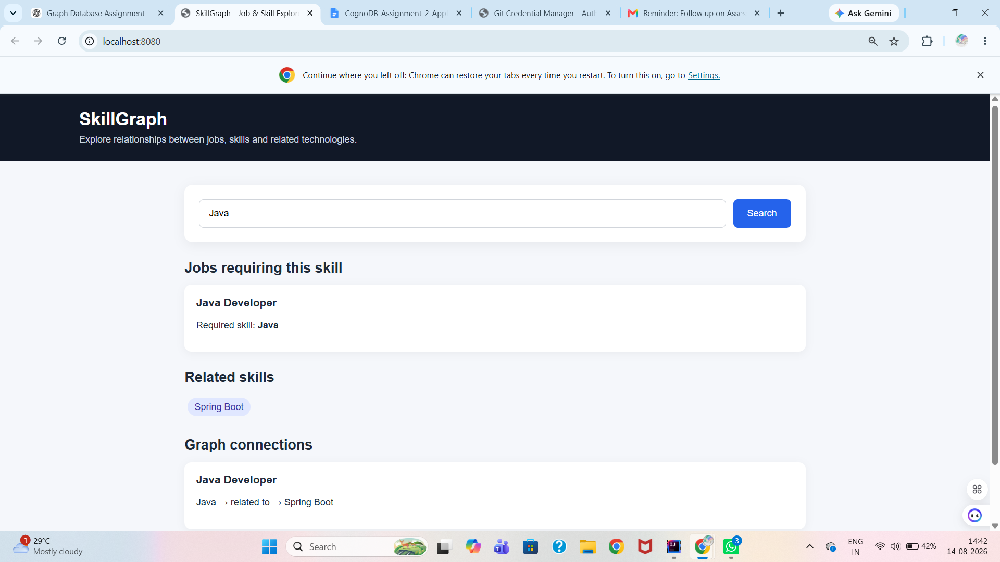
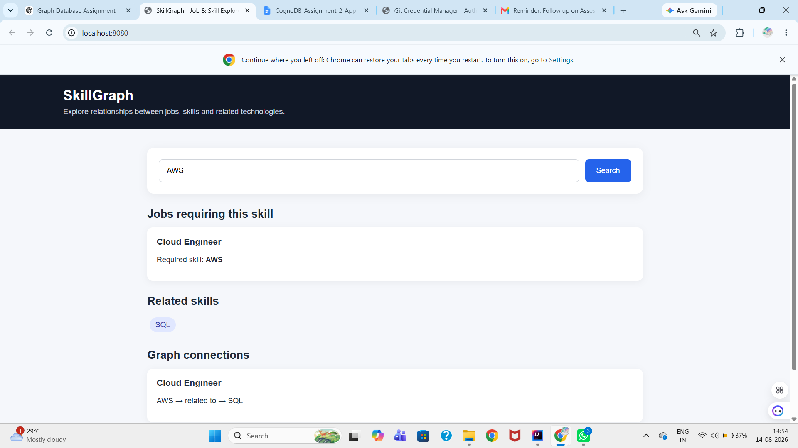
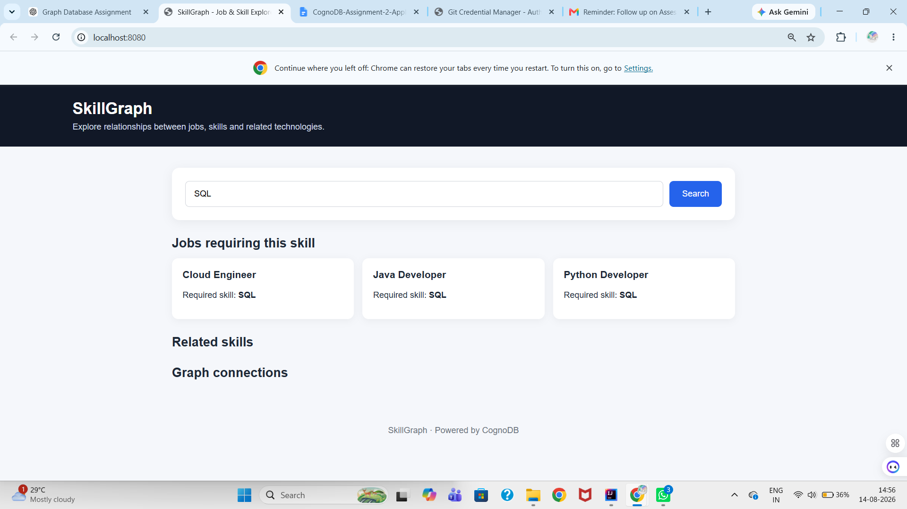

# SkillGraph – Job & Skill Explorer

SkillGraph is a graph-based job and skill exploration application built using Spring Boot and CognoDB (Neo4j-compatible graph database).

## Introduction

The application allows users to search for a skill and discover:

- Jobs requiring that skill
- Related skills
- Multi-hop relationships between jobs and skills

## Features

- Search jobs by skill
- Find related skills
- Explore graph connections
- Multi-hop graph traversal
- REST APIs using Spring Boot
- CognoDB graph database integration
- Simple web-based frontend
- Secure database credentials using environment variables

## Technology Stack

- Java 21
- Spring Boot 4
- Maven
- CognoDB / Neo4j-compatible graph database
- Neo4j Java Driver
- HTML
- CSS
- JavaScript

## Graph Model

The application uses the following nodes:

- `Company`
- `Job`
- `Skill`

Relationships:

```text
Company ──OFFERS──> Job
Job ──REQUIRES──> Skill
Skill ──RELATED_TO──> Skill
```
## Why a Graph Database?

SkillGraph focuses on relationships between companies, jobs and skills.

A graph database is a natural fit because the application needs to traverse relationships such as:

Company → Job → Required Skill → Related Skill

These connected queries are easier to model and explore using a graph database than with multiple relational tables and joins. Graph traversal also makes it straightforward to discover related skills and multi-hop connections for a given job or skill.

## Graph Data Model

```mermaid
graph LR
    Company -->|OFFERS| Job
    Job -->|REQUIRES| Skill
    Skill -->|RELATED_TO| Skill
## Sample Data

### Companies

- Google
- Microsoft
- Amazon

### Jobs

- Java Developer
- Python Developer
- Cloud Engineer

### Skills

- Java
- Python
- Spring Boot
- AWS
- SQL

## API Endpoints

### Health Check

```text
GET /api/health
```

Checks connectivity between the Spring Boot application and CognoDB.

Example response:

```text
SkillGraph is connected to CognoDB!
```

### Search Jobs by Skill

```text
GET /api/jobs?skill=Java
```

Example response:

```json
[
  {
    "job": "Java Developer",
    "skill": "Java"
  }
]
```

### Related Skills

```text
GET /api/related-skills?skill=Java
```

Example response:

```json
[
  {
    "skill": "Java",
    "relatedSkill": "Spring Boot"
  }
]
```

### Multi-Hop Graph Query

```text
GET /api/multi-hop?skill=Java
```

Example response:

```json
[
  {
    "job": "Java Developer",
    "requiredSkill": "Java",
    "relatedSkill": "Spring Boot"
  }
]
```

## Graph Query Examples

### Find jobs requiring a skill

```cypher
MATCH (j:Job)-[:REQUIRES]->(s:Skill)
WHERE s.name = $skill
RETURN j.title AS job, s.name AS skill
ORDER BY j.title
```

### Find related skills

```cypher
MATCH (s:Skill)-[:RELATED_TO]->(related:Skill)
WHERE s.name = $skill
RETURN s.name AS skill, related.name AS relatedSkill
ORDER BY related.name
```

### Multi-hop traversal

```cypher
MATCH (j:Job)-[:REQUIRES]->(s:Skill)-[:RELATED_TO]->(related:Skill)
WHERE s.name = $skill
RETURN j.title AS job,
       s.name AS requiredSkill,
       related.name AS relatedSkill
ORDER BY j.title, related.name
```

## Database Setup

The project contains the following database setup scripts:

- `schema.cypher`
- `data.cypher`

`schema.cypher` creates uniqueness constraints for Company, Job and Skill names.

`data.cypher` uses `MERGE` to safely create the sample graph data without creating duplicates when executed repeatedly.

## Environment Variables

The application uses environment variables for database credentials.

Required variables:

```text
COGNODB_URI
COGNODB_USERNAME
COGNODB_PASSWORD
```

The `.env` file is excluded from Git using `.gitignore`.

Do not commit database passwords or other secrets to the repository.

## Running the Application

1. Configure the required CognoDB environment variables.

2. Run `SkillgraphApplication` from IntelliJ.

3. Open the application:

```text
http://localhost:8080
```

4. Test the database connection:

```text
http://localhost:8080/api/health
```

Expected response:

```text
SkillGraph is connected to CognoDB!
```

## Project Structure

```text
skillgraph/
├── src/
│   └── main/
│       ├── java/
│       │   └── com/example/skillgraph/
│       │       ├── config/
│       │       ├── controller/
│       │       ├── repository/
│       │       ├── service/
│       │       └── SkillgraphApplication.java
│       │
│       └── resources/
│           ├── static/
│           │   └── index.html
│           └── application.properties
│
├── .env
├── .gitignore
├── pom.xml
└── README.md
```

## Validation

The application has been tested with:

- Java skill search
- Python skill search
- AWS skill search
- SQL skill search
- Related skill traversal
- Multi-hop graph traversal
- CognoDB connectivity
- Spring Boot application startup
- Frontend search functionality

## UI Screenshots

### Skill Search – Java



### Skill Search – AWS



### Skill Search – SQL



## Future Improvements

- Add more jobs, companies and skills
- Add user authentication
- Add graph visualization
- Add job recommendations
- Add skill-gap analysis
- Add filtering by company or job category
- Deploy the application to a cloud platform

## Author

Ananya Nagaraj